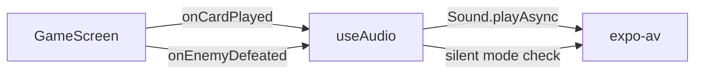

# Design Document — Project Overhaul

## Overview

This document describes the technical design for the comprehensive overhaul of the **Regicide Tracker** — a React Native / Expo companion app for the cooperative card game Regicide. The overhaul targets six areas: clean architecture, descriptive naming, English comments, living documentation, multiplayer infrastructure, and audio organisation.

The app is built with Expo SDK (new architecture enabled), Expo Router for file-based navigation, React Native, TypeScript strict mode, i18next for internationalisation, and AsyncStorage for local persistence. After the overhaul the app must remain fully functional in its existing single-player digital mode and physical tracker mode while gaining a clean, maintainable codebase and real-time multiplayer capability.

---

## Architecture

### Current State

The project already follows a reasonable layered structure:

```
app/           — Expo Router entry points (thin wrappers)
assets/        — Static files (images, audio, fonts)
components/    — Reusable UI components
data/          — Pure data definitions and types (deck, enemies, heroes, types)
hooks/         — React custom hooks (useGame, useTracker)
i18n/          — Internationalisation (i18next config + locale files)
screens/       — Full-screen view components
services/      — Side-effectful services (storage)
utils/         — Pure utility functions (gameLogic, shuffle, responsive)
```

The overhaul preserves this structure and extends it with:

- `services/session.ts` — WebSocket session management
- `hooks/useMultiplayer.ts` — Multiplayer state hook
- `hooks/useAudio.ts` — Centralised audio playback hook
- `components/multiplayer/` — Session UI components (CreateSession, JoinSession, PlayerCount)

### Multiplayer Architecture

The multiplayer system uses a **host-authoritative** model over WebSockets:

```mermaid
graph TD
    subgraph Client A — Host
        HA[useGame] -->|GameState| HM[useMultiplayer]
        HM -->|send state| WS_H[WebSocket]
    end

    subgraph Server
        SRV[Session Server]
        SRV -->|broadcast| WS_G1
        SRV -->|broadcast| WS_G2
        WS_H -->|action| SRV
    end

    subgraph Client B — Guest
        WS_G1[WebSocket] -->|receive state| GM[useMultiplayer]
        GM -->|setGameState| GB[useGame read-only view]
    end

    subgraph Client C — Guest
        WS_G2[WebSocket] -->|receive state| GM2[useMultiplayer]
        GM2 -->|setGameState| GB2[useGame read-only view]
    end
```

Key design decisions:

- **Host authority**: Only the Session_Host runs `useGame` in write mode. Guests receive `GameState` snapshots and render them read-only.
- **Full-state sync**: Each action sends the complete serialised `GameState` rather than deltas. This keeps the protocol simple and avoids conflict resolution complexity at the cost of slightly larger payloads (~2–4 KB per message).
- **Pure Game_Engine**: `gameLogic.ts`, `deck.ts`, and `enemies.ts` remain pure functions with no side effects, making them safe to call on any device for local validation.
- **Session server**: A lightweight Node.js WebSocket server (using the `ws` package) manages session rooms. It is stateless beyond the active room registry — it does not store `GameState`, only relays it.

### Audio Architecture

Audio is centralised in `hooks/useAudio.ts` using `expo-av`. The hook loads sound objects once on mount and exposes named play functions. Screens and components call these functions; they never import `expo-av` directly.



---

## Components and Interfaces

### New / Modified Components

#### `hooks/useAudio.ts`

```typescript
interface AudioHook {
  playCardSound: () => Promise<void>;
  playEnemyDefeatedSound: () => Promise<void>;
  playVictorySound: () => Promise<void>;
  isLoaded: boolean;
}

export const useAudio = (): AudioHook
```

Loads foley and soundtrack assets via `expo-av`. Checks `Audio.setAudioModeAsync` for silent-mode compatibility. All play calls are fire-and-forget with internal error suppression so a failed audio call never crashes the UI.

#### `hooks/useMultiplayer.ts`

```typescript
export type SessionRole = "host" | "guest" | "none";

export interface MultiplayerState {
  sessionCode: string | null;
  role: SessionRole;
  connectedPlayerCount: number;
  isReconnecting: boolean;
  connectionError: string | null;
}

interface MultiplayerHook extends MultiplayerState {
  createSession: () => Promise<void>;
  joinSession: (code: string) => Promise<void>;
  leaveSession: () => void;
  broadcastState: (state: GameState) => void;   // host only
  onRemoteState: (handler: (state: GameState) => void) => void; // guest only
}

export const useMultiplayer = (): MultiplayerHook
```

Manages the WebSocket lifecycle. On disconnect it starts a 30-second reconnection loop with exponential back-off (using the existing `exponential-backoff` package already in `node_modules`). After 30 seconds without reconnection it calls `leaveSession` and navigates to the Home Screen.

#### `services/session.ts`

```typescript
export interface SessionService {
  connect: (serverUrl: string) => WebSocket;
  createRoom: (ws: WebSocket) => Promise<string>; // returns Session_Code
  joinRoom: (ws: WebSocket, code: string) => Promise<void>;
  sendState: (ws: WebSocket, state: GameState) => void;
  onStateReceived: (ws: WebSocket, handler: (state: GameState) => void) => void;
  closeRoom: (ws: WebSocket) => void;
}
```

Thin wrapper around the browser/React Native `WebSocket` API. All JSON serialisation/deserialisation of `GameState` happens here.

#### `components/multiplayer/CreateSessionButton.tsx`

Props: `{ onSessionCreated: (code: string) => void; isLoading: boolean }`

Renders the "Create Session" card on the Home Screen. Displays the generated `Session_Code` in a copyable text field once created.

#### `components/multiplayer/JoinSessionInput.tsx`

Props: `{ onJoin: (code: string) => void; error: string | null; isLoading: boolean }`

Renders the "Join Session" card with a text input for the Session_Code and an error label.

#### `components/multiplayer/PlayerCountBadge.tsx`

Props: `{ count: number }`

Small badge displayed in the game header showing the number of connected players during an active multiplayer session.

### Modified Existing Components

- **`screens/HomeScreen.tsx`**: Adds `CreateSessionButton` and `JoinSessionInput` below the existing navigation cards.
- **`screens/GameScreen.tsx`**: Integrates `useAudio` calls at card-play and enemy-defeat transitions; adds `PlayerCountBadge` to the header when a session is active.
- **`hooks/useGame.ts`**: Accepts an optional `externalState` parameter — when provided (guest mode), the hook skips local state management and returns the external state directly.

---

## Data Models

### Existing Types (unchanged)

```typescript
// data/types.ts — no new fields added for multiplayer
export type Suit = "hearts" | "diamonds" | "clubs" | "spades";
export type EnemyRank = "J" | "Q" | "K";
export type CardRank =
  | "2"
  | "3"
  | "4"
  | "5"
  | "6"
  | "7"
  | "8"
  | "9"
  | "10"
  | "A"
  | "Jester"
  | EnemyRank;

export interface Enemy {
  id: string;
  suit: Suit;
  rank: EnemyRank;
  health: number;
  attack: number;
}
export interface Card {
  id: string;
  rank: CardRank;
  suit: Suit | null;
  value: number;
}
export type GamePhase = "player_turn" | "suffer_damage" | "victory" | "defeat";
export interface GameState {
  /* existing fields — canonical sync unit */
}
```

`GameState` is already fully serialisable (no functions, no circular references, no `Date` objects). It is used as-is as the State_Sync payload.

### New Types

```typescript
// services/session.ts
export type SessionCode = string; // 6-character alphanumeric, e.g. "A3F7K2"

export type WebSocketMessageType =
  | "CREATE_ROOM"
  | "JOIN_ROOM"
  | "ROOM_CREATED"
  | "ROOM_JOINED"
  | "STATE_UPDATE"
  | "PLAYER_COUNT"
  | "ERROR"
  | "CLOSE_ROOM";

export interface WebSocketMessage {
  type: WebSocketMessageType;
  payload?: unknown;
}

export interface StateUpdatePayload {
  state: GameState;
}

export interface RoomCreatedPayload {
  code: SessionCode;
}

export interface PlayerCountPayload {
  count: number; // 1–4
}

export interface ErrorPayload {
  message: string;
}
```

### Audio Asset Registry

```typescript
// hooks/useAudio.ts
const FOLEY_ASSETS = {
  cardPlay: require("../assets/folley/card-play.mp3"),
  enemyDefeated: require("../assets/folley/enemy-defeated.mp3"),
  swordDraw: require("../assets/folley/sword-draw.mp3"),
  cardShuffle: require("../assets/folley/card-shuffle.mp3"),
} as const;

const SOUNDTRACK_ASSETS = {
  mainTheme: require("../assets/soundtrack/main-theme.mp3"),
  battleAmbient: require("../assets/soundtrack/battle-ambient.mp3"),
  victory: require("../assets/soundtrack/victory.mp3"),
} as const;
```

Existing filenames in `assets/folley/` and `assets/soundtrack/` will be renamed to match the descriptive, lowercase, hyphen-separated convention required by Requirement 6.1–6.2.

---

## Correctness Properties

_A property is a characteristic or behavior that should hold true across all valid executions of a system — essentially, a formal statement about what the system should do. Properties serve as the bridge between human-readable specifications and machine-verifiable correctness guarantees._

### Property 1: Session codes are unique

_For any_ sequence of `n` calls to `createSession`, all `n` returned Session_Codes should be distinct.

**Validates: Requirements 5.1**

### Property 2: Invalid session codes produce errors

_For any_ string that is not a currently active Session_Code, calling `joinSession` with that string should result in a non-null `connectionError` and a `role` of `"none"`.

**Validates: Requirements 5.5**

### Property 3: Received game state is rendered

_For any_ valid `GameState` object delivered to a guest client via `onRemoteState`, the hook's exposed state should equal the received `GameState` after the update is applied.

**Validates: Requirements 5.7**

### Property 4: Session terminates when all players disconnect

_For any_ active session, when all connected participants close their WebSocket connections, the server-side room should be removed from the active room registry.

**Validates: Requirements 5.10**

### Property 5: Player count is within valid bounds

_For any_ session, the `connectedPlayerCount` exposed by `useMultiplayer` should always be in the range [1, 4]. Attempting to join a session that already has 4 players should be rejected with an error.

**Validates: Requirements 5.11, 5.12**

### Property 6: Game engine is referentially transparent

_For any_ `GameState` and any set of selected card IDs, calling `resolvePlay` twice with identical arguments should return structurally equal results (same new hand, same damage, same shield).

**Validates: Requirements 5.13**

### Property 7: GameState serialisation round-trip

_For any_ valid `GameState`, serialising it to JSON and deserialising it should produce a structurally equal object — all fields preserved with the same values and types.

**Validates: Requirements 5.14**

### Property 8: Audio events fire on game state transitions

_For any_ call to `playSelected` that results in a card being played, the `useAudio` hook's `playCardSound` function should be invoked exactly once. _For any_ call to `playSelected` that results in an enemy being defeated, `playEnemyDefeatedSound` should be invoked exactly once.

**Validates: Requirements 6.3, 6.4**

---

## Error Handling

### Multiplayer Errors

| Scenario                        | Handling                                                                       |
| ------------------------------- | ------------------------------------------------------------------------------ |
| Invalid Session_Code on join    | `connectionError` set to descriptive message; UI shows error label under input |
| WebSocket connection failure    | Retry with exponential back-off (100 ms base, 2× multiplier, max 30 s)         |
| Reconnection timeout (30 s)     | `leaveSession()` called; navigate to Home Screen; user notified via alert      |
| Server sends malformed JSON     | Message silently dropped; `console.error` logged                               |
| Session at capacity (4 players) | Server sends `ERROR` message; `connectionError` set; join rejected             |
| Host disconnects mid-game       | Guests receive `CLOSE_ROOM` message; shown alert; returned to Home Screen      |

### Audio Errors

All `Sound.playAsync` calls are wrapped in try/catch. Errors are swallowed silently (audio failure must never crash the game). Silent mode is handled by setting `Audio.setAudioModeAsync({ playsInSilentModeIOS: false })` — the OS will suppress playback automatically.

### Storage Errors

`saveGame` and `loadGame` already have try/catch. No changes needed.

### TypeScript Strict Mode

All `any` types will be replaced with proper types during the refactoring pass. The `tsconfig.json` already has `"strict": true`; the overhaul enforces zero `any` in production source files via ESLint's `@typescript-eslint/no-explicit-any` rule set to `"error"`.

---

## Testing Strategy

### Dual Testing Approach

Both unit tests and property-based tests are required. They are complementary:

- **Unit tests** verify specific examples, integration points, and edge cases.
- **Property-based tests** verify universal invariants across randomly generated inputs.

### Property-Based Testing

The project uses **fast-check** (already transitively available via the test toolchain; add as a direct `devDependency`). Each property test runs a minimum of **100 iterations**.

Each test is tagged with a comment in the format:
`// Feature: project-overhaul, Property N: <property text>`

| Property                                  | Test file                          | fast-check arbitraries                                                       |
| ----------------------------------------- | ---------------------------------- | ---------------------------------------------------------------------------- |
| P1 — Session codes unique                 | `__tests__/session.test.ts`        | `fc.integer({ min: 1, max: 1000 })` for call count                           |
| P2 — Invalid codes produce errors         | `__tests__/useMultiplayer.test.ts` | `fc.string()` filtered to exclude valid codes                                |
| P3 — Received state is rendered           | `__tests__/useMultiplayer.test.ts` | `fc.record(...)` matching `GameState` shape                                  |
| P4 — Session terminates on all-disconnect | `__tests__/session.test.ts`        | `fc.integer({ min: 2, max: 4 })` for player count                            |
| P5 — Player count bounds                  | `__tests__/useMultiplayer.test.ts` | `fc.integer({ min: 0, max: 10 })` for join attempts                          |
| P6 — Game engine referential transparency | `__tests__/gameLogic.test.ts`      | `fc.record(...)` matching `GameState` + `fc.array(fc.string())` for card IDs |
| P7 — GameState serialisation round-trip   | `__tests__/storage.test.ts`        | `fc.record(...)` matching `GameState` shape                                  |
| P8 — Audio events on transitions          | `__tests__/useAudio.test.ts`       | `fc.record(...)` matching `GameState` with mock audio hook                   |

### Unit Tests

Unit tests focus on:

- **`validatePlay`**: specific valid and invalid card combinations (Jester alone, Animal Companion combos, combo total > 10, etc.)
- **`resolvePlay`**: hearts heal, diamonds draw, clubs double damage, spades shield — each suit power in isolation and in combination
- **`createTavernDeck`**: correct card counts per player count
- **`createCastleDeck`**: 12 enemies (4 suits × 3 ranks), correct HP/attack values
- **`useTracker`**: `applyAttack` immunity logic, `defeatCurrentEnemy` advances to next enemy
- **`services/storage`**: `saveGame` / `loadGame` round-trip with AsyncStorage mock
- **Multiplayer edge cases**: reconnection state machine transitions (connecting → reconnecting → disconnected)

### Test File Structure

```
__tests__/
  gameLogic.test.ts      — validatePlay, resolvePlay, getCompatibleCardIds
  deck.test.ts           — createTavernDeck, createCastleDeck
  storage.test.ts        — saveGame/loadGame round-trip (P7)
  session.test.ts        — session code uniqueness (P1), all-disconnect cleanup (P4)
  useMultiplayer.test.ts — invalid code errors (P2), state sync (P3), player count (P5)
  useAudio.test.ts       — audio events on transitions (P8)
  useTracker.test.ts     — tracker hook unit tests
```
